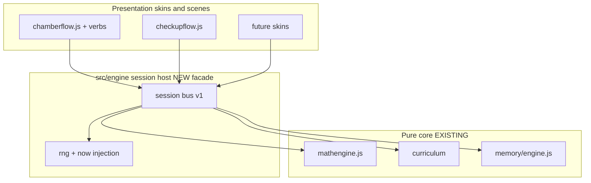

# Engine extraction — harden curriculum-as-engine inside this repo

Extraction means clearer module seams and a session facade, not moving code
to jarenjs. The engine stays in Monkeygrove.

See SESSION_PROTOCOL.md and ROADMAP.md.

## Current seams (already good)

- Math: src/mathengine.js — pure; rng and now injected; split under src/math/
- Curriculum: src/curriculum/index.js, placement.js, checkup.js
- Memory: src/memory/engine.js — anchors, probes, walks
- Chamber orchestration: src/chamberflow.js — still imports three/verbs
- Checkup UI: src/checkupflow.js — UI and machine glue
- Persist: src/state.js — owns profile.math, curriculum, memory

ARCHITECTURE.md already defines function-level math and curriculum contracts.
This doc turns them into an engine host skins can depend on without importing
chamberflow.js.

## Target shape

Suggested new paths (implementation later — not created by this planning pass):

- src/engine/session.js — hello/welcome, dispatch practice/checkup/memory
- src/engine/dto.js — problem/result mappers (strip internal fields)
- schemas/ — JSON Schema once Phase B starts

Do not relocate generators or nl_po.js during facade work.

## Hardening checklist

### 1. Single write paths

- All Elo / fact / log mutations go through recordResult,
  recordCalibration, reinforceSkill (src/math/results.js).
- All placement mutations through applyCheckupResult,
  setCurriculumGroep, applyParentPatch, refreshCurriculumForDate.
- All memory mutations through src/memory/engine.js exports.
- Ban ad-hoc profile.math.skills writes outside those modules.

### 2. Facade over chamberflow

Strangler steps:

1. Extract pick-problem-with-eligibility helper used by chamberflow.js
   (eligibleSkillIds + nextProblem) into the session host.
2. Extract submit-answer path (recordResult + reward preview) similarly.
3. Keep verb/Three code in place; only protocol DTOs cross the facade.
4. When a second skin appears, it uses the facade only (MULTI_SKIN.md).

### 3. Checkup purity preserved

- Keep checkup.js free of DOM (already).
- checkupflow.js becomes a skin of the checkup message group.
- Batch calibration at settle remains host-owned.

### 4. Tests

- Unit: DTO round-trips; illegal skin payloads rejected; same seed same problem.
- Integration: facade chamber of 3 problems matches chamberflow mastery.
- Existing: vitest + test:e2e + test:e2e:memory stay green.

### 5. Scene registry stays separate

src/scenes/registry.js switches activities (business, stage). Engine session
is not a scene; scene controllers adapt to the session.

## Non-goals

- Publishing a monkeygrove engine package immediately (optional later).
- Rewriting generators into schema-only definitions.
- Moving files into /workspace/jarenjs.
- Changing child-facing pedagogy (docs/01-06 remain canon).

## Exit criteria (Phase A)

- Session facade used by checkup or chamber without behavior change.
- Message list matches SESSION_PROTOCOL.md v1.
- Golden fixtures for problem DTO and practice.result committed.
- No new imports from verbs or Three into pure core.
- Tests and e2e smoke stay green.

## Cross-links

- Protocol: [SESSION_PROTOCOL.md](./SESSION_PROTOCOL.md)
- jarenjs validate later: [JARENJS_INTEGRATION.md](./JARENJS_INTEGRATION.md)
- Roadmap: [ROADMAP.md](./ROADMAP.md)
