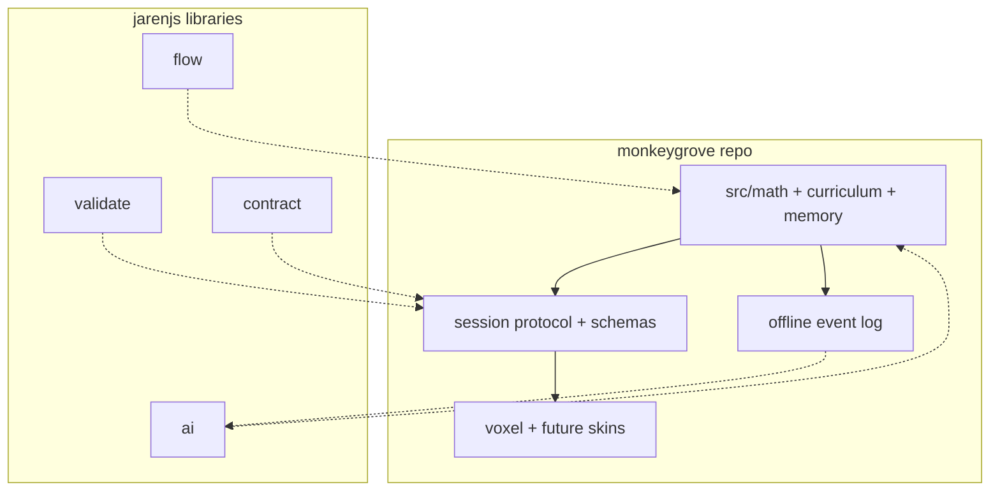

# Jarenjs integration — consume inside Monkeygrove

**Critical:** optimally use jarenjs **inside** Monkeygrove. Do **not** move
curriculum packs, ladder data, verbs, or island UX into the jarenjs monorepo
(`/workspace/jarenjs`). Upstream generalizations are optional — see
[UPSTREAM_TO_JARENJS.md](./UPSTREAM_TO_JARENJS.md).

## What Monkeygrove keeps local

| Concern | Paths | Why local |
|---------|-------|-----------|
| Dutch primary pack | `src/curriculum/nl_po.js` | Product pedagogy |
| 64-step ladder | `src/curriculum/ladder.js`, docs/04 | Domain content |
| Placement / checkup | `src/curriculum/placement.js`, `checkup.js` | Child-specific policy |
| Math generators and Elo | `src/mathengine.js`, `src/math/` | Game skill ladder |
| Memory Grove | `src/memory/`, docs/06 | Product feature |
| Voxel / verbs / hub | `src/verbs/`, `chamberflow.js`, `hub.js`, `scenes/` | Presentation |
| Save format | `src/state.js` (`monkeygrove.save`) | Game economy + profiles |
| Story / yijing | `src/story/`, `src/yijing/` | Narrative |

## What Monkeygrove consumes from jarenjs

| Package | Use in Monkeygrove | Phase |
|---------|-------------------|-------|
| validate | Session messages, event envelopes, save guards, problem DTOs | B |
| formats / refs | As needed by schemas | B |
| contract | Optional typed ports / ledger for engine-skin + exports | C |
| flow | Optional FSM beside checkup.js (experiment) | C |
| ai | Online tutor: schema-validated tools wrapping engine APIs | D |
| db | Not required for default PWA | Out of scope |

Scoped names: @jarenjs/validate, formats, refs, contract, flow, ai, db. Consumption modes are
documented in jarenjs CONSUMING.md using registry installs or a pinned
source checkout. Monkeygrove remains a Vite ESM app with three as its
only runtime dependency; jarenjs packages are also ESM.

## Architecture — consume, do not absorb

## Phased adoption

### Phase A — no jarenjs yet
Session facade over nextProblem, recordResult, eligibleSkillIds, checkup_*,
memory_*. Golden fixtures under tests/ for DTOs without schema compile.
See ROADMAP.md and ENGINE_EXTRACTION.md.

### Phase B — validate
JSON Schemas for monkeygrove.session v1 and telemetry envelopes. Compile
validators at init; assert in tests and DEV; soft-fail in production.
Optional: validate migrated saves after state.js migrations.

### Phase C — contract / flow selective
contract package if iframe/worker ports or export ledgers appear. Prototype
checkup as flow FSM beside checkup.js; JS remains source of truth until
parity tests pass.

### Phase D — ai online only
Tools: request_practice, explain_from_result, suggest_memory_hint,
summarize_mastery_for_parent. Schema-validated; tools call engine functions;
model never invents skill paths or free-form equations. Needs network plus
explicit parent/guardian enablement; offline play unchanged.

## Non-goals
- Creating a jarenjs curriculum package or moving NL_PO upstream as a blocker.
- Depending on the db package for default saves (localStorage stays).
- Blocking releases on jarenjs publish cadence — pin commits if needed.
- Using AI packages before Phases A-C exit criteria.

## Cross-links
- SESSION_PROTOCOL.md, ENGINE_EXTRACTION.md, MEMORY_AND_TELEMETRY.md
- ROADMAP.md, UPSTREAM_TO_JARENJS.md
