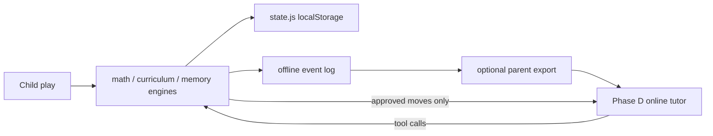

# Memory and telemetry — offline-first, AI-ready later

Memory-aware help ships **before** AI tutoring. Structured on-device events make
later online tutors possible without inventing math paths.

## Existing memory product

| Concern | Path |
|---------|------|
| Engine | `src/memory/engine.js` |
| Anchor data | `src/memory/data.js` |
| Probe / walk UI flows | `src/memory/probeflow.js`, `walkflow.js` |
| Pedagogy | `docs/06-memoization.md` |
| Profile subtree | `profile.memory` via `state.js` |

Key APIs: `anchorForProblem`, `pickHintArm`, `recordAnchorRecall`,
`adoptAnchor`, `buildProbe`, `buildSkipWalk`, `memoryUnlocked`.

Chamber already consults memory from `chamberflow.js` for hints and recall.

## Event log (new, offline-first)

Append-only, versioned envelopes beside the save blob (e.g. monkeygrove.events
or a ring buffer inside the save under a new key). Child play must never block
on network.

### Envelope sketch

```json
{
  "v": 1,
  "ts": 0,
  "profileId": "p…",
  "sessionId": "s…",
  "skinId": "voxel",
  "abArm": "control",
  "type": "practice.result",
  "payload": {}
}
```

### Event types (AI-ready later)

| type | payload highlights |
|------|-------------------|
| practice.problem | skillId, world, kind, scaffold, problemId |
| practice.result | correct, ms, usedHint, misconception tag, delta |
| checkup.item / settled | frontier evidence (no child-facing scores) |
| memory.hint / recall | factKey, arm, ok |
| skin.hello | capabilities |
| ab.expose | experiment id, arm |

`ts` and rng seeds come from the session host (same determinism rules as
mathengine.js).

## Data flow



## Help priority (before AI)

1. Misconception-tagged visual model from the problem (`choices` tags).
2. Scaffold level from rating (`scaffoldFor` in `src/math/rating.js`).
3. Memory Grove anchor / loci hint when unlocked and adopted.
4. Helper friend one-liner (`explain` key) — still authored copy, not generative.
5. Only later: AI paraphrase of engine-approved explain + memory context.

## Non-goals

- Cloud telemetry by default; no accounts.
- Sending raw answers to a model that then invents the next problem.
- Replacing Memory Grove with chat.
- Surfacing Elo numbers to children.

## Cross-links

- SESSION_PROTOCOL.md memory messages
- JARENJS_INTEGRATION.md Phase D
- AB_TESTING.md metrics from the same events
- ROADMAP.md
