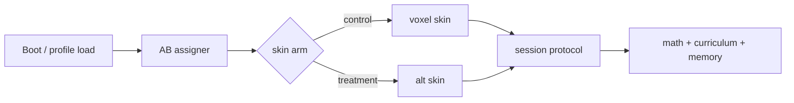

# Multi-skin frontends — voxel default + A/B looks

Skins are **presentation adapters** over the same session protocol. They share
problems, ratings, curriculum eligibility, and memory hints; they differ in
look, input chrome, and juice.

## Current skin (voxel)

| Piece | Path |
|-------|------|
| Chamber run | `src/chamberflow.js` |
| Verbs | `src/verbs/` (Fetch, Array, Line, Share, VerbBase) |
| Hub island | `src/hub.js`, `src/island.js`, `src/voxel.js` |
| Mount helper | `src/scenes/mount.js` |
| Activity registry | `src/scenes/registry.js` (business, stage, …) |
| DOM overlay | `src/hud.js`, `src/screens.js`, `src/appflow.js` |

This remains the **default** and the quality bar (DESIGN.md: cozy voxel,
orthographic isometric, DOM text with large touch targets).

## Future skins (examples — not commitments)

- Flat / paper — 2D boards, same verbs as intents (fetch/array/line/share).
- High contrast / low motion — accessibility-first; protocol-identical.
- Classroom projector — larger type, teacher glance mode when unlocked.

Each skin declares skinId, protocol v range, and capabilities
(e.g. verb.array, hint.memory, input.touch).

## Selection and A/B

Assignment lives in save settings or profile.flags.ab, sticky per profile —
details in AB_TESTING.md. Engine never branches on skinId for pedagogy
(no different Elo targets per look). Exception: capability negotiation.

## Adapter pattern

SkinController: enter/exit/update (3D skins may use scenes/mount),
onSessionMessage(msg), send(msg) to host.

Voxel path: wrap ChamberFlow so it emits/consumes protocol messages
internally (strangler), then alternate skins implement the same surface
without Three.

Scenes in registry.js stay for places (bakery, stage). A skin may mount
different visuals for the same place id; unlock rules (isBuilt in island.js)
stay game-economy owned.

## Capability negotiation

On session.hello the skin lists capabilities. Host intersects with kinds from
skillSupportsKind / generators. Never invent a new pedagogic path because a
skin lacks a verb — fall back to fetch or skip with eligible skills, matching
chamberflow.js rerouting today.

## Non-goals

- Multiple conflicting curricula per skin.
- Per-skin save formats (one monkeygrove.save).
- Shipping three skins before the facade exists (ENGINE_EXTRACTION.md).
- Visual redesign of voxel as a prerequisite for the protocol.

## Cross-links

- SESSION_PROTOCOL.md, AB_TESTING.md, VISION.md, ROADMAP.md
