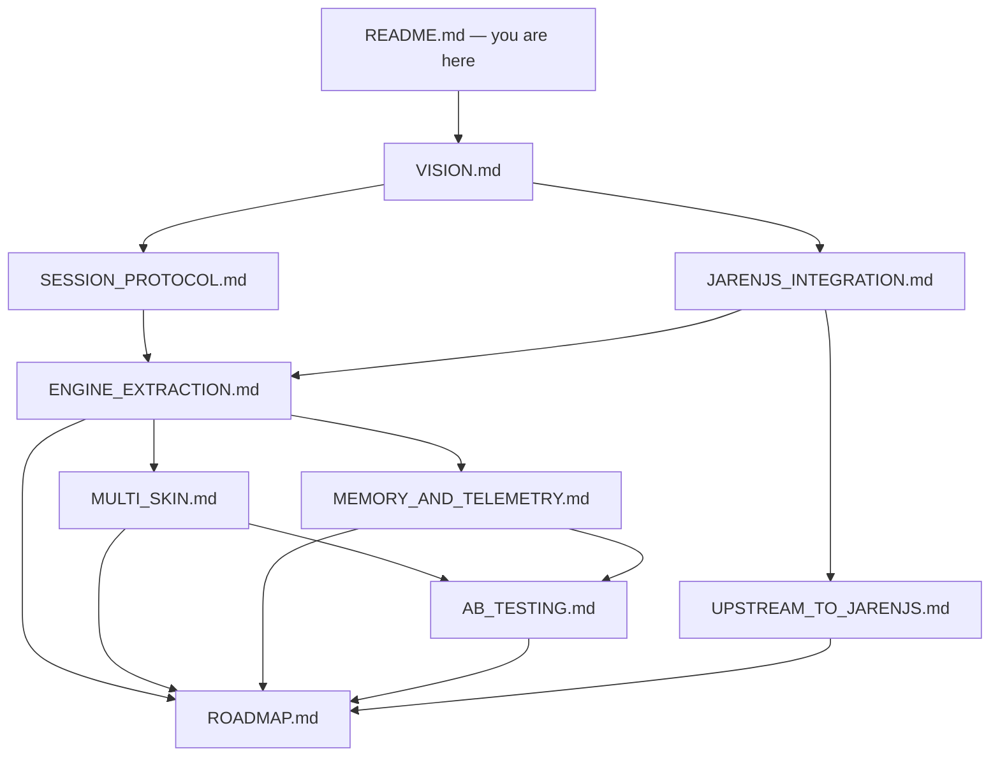

# Monkeygrove next — planning index

Planning docs for the **next major slice of Monkeygrove**: harden the
curriculum/math stack as a versioned **engine**, put thin **skins** (voxel today,
future looks later) on a shared session protocol, keep **memory + telemetry**
offline-first and AI-ready, and only then add optional online AI tutoring that
**never invents math paths**.

These files are **markdown only**. They do not change game code. Canonical
runtime docs remain:

- [README.md](../../README.md) — product overview
- [DESIGN.md](../../DESIGN.md) — child-facing design canon
- [ARCHITECTURE.md](../../ARCHITECTURE.md) — technical layout & contracts
- [docs/](../) — pedagogy notes (`01`–`06`, story packs)

## Author intent (non-negotiable)

1. **Consume jarenjs inside Monkeygrove.** Pin/vend packages (`@jarenjs/validate`,
   later `@jarenjs/contract`, `@jarenjs/flow`, `@jarenjs/ai`) into *this* repo.
   Do **not** move NL_PO, the 64-step ladder, chamber verbs, or island UX into
   the jarenjs monorepo.
2. **Sequence:** curriculum-as-engine + multi-skin frontends + memory-aware help
   **first**. AI tutoring **later**, only when online, and only by consuming
   structured offline events / engine-approved moves.
3. **A/B frontends** against one engine protocol (same problems, same ratings,
   different looks/interaction chrome).
4. **Upstream ideas** that generalize beyond Monkeygrove belong in
   [UPSTREAM_TO_JARENJS.md](./UPSTREAM_TO_JARENJS.md) — optional proposals, not
   a migration plan.

## Goals

| Goal | Doc |
|------|-----|
| Shared product vision & constraints | [VISION.md](./VISION.md) |
| Thin versioned engine↔skin contract | [SESSION_PROTOCOL.md](./SESSION_PROTOCOL.md) |
| What Monkeygrove takes from jarenjs vs keeps local | [JARENJS_INTEGRATION.md](./JARENJS_INTEGRATION.md) |
| Harden curriculum/math as in-repo engine | [ENGINE_EXTRACTION.md](./ENGINE_EXTRACTION.md) |
| Voxel + future skins; A/B selection hooks | [MULTI_SKIN.md](./MULTI_SKIN.md) |
| Offline events → later AI-ready memory | [MEMORY_AND_TELEMETRY.md](./MEMORY_AND_TELEMETRY.md) |
| Frontend A/B metrics & kid/school ethics | [AB_TESTING.md](./AB_TESTING.md) |
| Optional generalized upstream contributions | [UPSTREAM_TO_JARENJS.md](./UPSTREAM_TO_JARENJS.md) |
| Phased roadmap; AI last; exit criteria | [ROADMAP.md](./ROADMAP.md) |

## Non-goals (this planning set)

- Moving curriculum packs, ladder data, or pedagogy into jarenjs.
- Shipping AI tutoring in the first phases (see [ROADMAP.md](./ROADMAP.md)).
- Letting an LLM invent problems, skill order, or “next best move” outside
  `nextProblem` / checkup / memory engines.
- Adding accounts, a mandatory server, or always-online play (PWA +
  `localStorage` under `monkeygrove.*` stays the default — see
  `ARCHITECTURE.md` hard constraints).
- Rewriting Three.js voxel rendering or replacing `src/scenes/registry.js`
  with a framework.
- Duplicating `ARCHITECTURE.md` file-by-file here — cite paths, don’t reprint.

## Reading order

1. [VISION.md](./VISION.md) — why this shape
2. [SESSION_PROTOCOL.md](./SESSION_PROTOCOL.md) — the thin contract skins share
3. [JARENJS_INTEGRATION.md](./JARENJS_INTEGRATION.md) — consume, don’t relocate
4. [ENGINE_EXTRACTION.md](./ENGINE_EXTRACTION.md) — harden in-repo seams
5. [MULTI_SKIN.md](./MULTI_SKIN.md) + [MEMORY_AND_TELEMETRY.md](./MEMORY_AND_TELEMETRY.md)
6. [AB_TESTING.md](./AB_TESTING.md)
7. [UPSTREAM_TO_JARENJS.md](./UPSTREAM_TO_JARENJS.md) — optional
8. [ROADMAP.md](./ROADMAP.md) — phases & exit criteria

## Real code anchors (cite these, not invented paths)

| Area | Paths |
|------|--------|
| Math barrel | `src/mathengine.js` → `src/math/{config,rating,choices,selection,results}.js`, `src/math/generators/*` |
| Curriculum | `src/curriculum/{index,nl_po,placement,checkup,ladder,domains}.js` |
| Memory Grove | `src/memory/{engine,data,probeflow,walkflow}.js` |
| Save / profiles | `src/state.js` (`monkeygrove.save`, VERSION) |
| Chamber loop | `src/chamberflow.js`, `src/verbs/*` |
| Scenes | `src/scenes/registry.js`, `src/scenes/mount.js` |
| Shell | `src/main.js`, `src/appflow.js`, `src/checkupflow.js` |
| Pedagogy docs | `docs/01-learn.md` … `docs/06-memoization.md` |

Sibling toolchain checkout (consume from, do not absorb curriculum into):
`/workspace/jarenjs` — packages `@jarenjs/validate`, `@jarenjs/contract`,
`@jarenjs/flow`, `@jarenjs/ai`, `@jarenjs/db`, etc.
