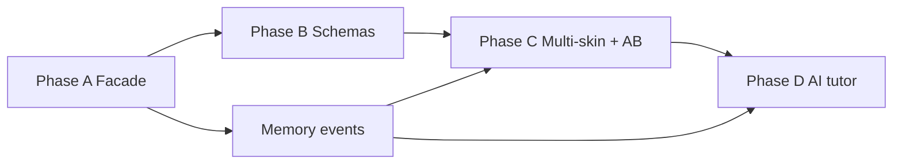

# Roadmap — phases and exit criteria (AI last)

Sequence is intentional: engine + skins + memory/telemetry first;
AI tutoring last, online-only, consuming structured offline data and
engine-approved moves only.

## Phase A — Curriculum-as-engine facade (in-repo)

Do: Session host over existing pure APIs (mathengine.js, curriculum/*,
memory/engine.js); strangler for checkup and/or chamber; golden DTO fixtures.

Do not: Add jarenjs deps yet; move files to jarenjs; change pedagogy.

Exit:
- Facade used on at least one live path without behavior change
- SESSION_PROTOCOL.md v1 messages implemented for that path
- Fixtures committed; unit tests for determinism (same seed same problem)
- Existing unit and e2e suites stay green

See ENGINE_EXTRACTION.md, SESSION_PROTOCOL.md.

## Phase B — Schema validation via jarenjs

Do: Depend on validate (and formats/refs as needed). Author schemas for
session + events. DEV/test asserts; production soft-fail + log.

Do not: Require network; start AI.

Exit:
- Validators compile and catch fixture mutations
- Save migration path can optionally validate
- Documented in JARENJS_INTEGRATION.md (pinned commit or registry version)

## Phase C — Multi-skin + A/B + memory events

Do: Second skin or chrome variant behind sticky AB assignment; offline event
log powering AB metrics; memory hints remain primary help.

Do not: Pedagogy forks per arm; cloud telemetry by default; AI chat.

Exit:
- Two skins complete a chamber via protocol only for the new skin
- AB assignment sticky; metrics defined in AB_TESTING.md
- Event log survives offline week and exports cleanly
- MEMORY_AND_TELEMETRY.md event types implemented for practice + memory

## Phase D — AI tutoring (last, online only)

Do: jarenjs ai toolbox whose tools only call engine APIs (request practice,
explain from result, memory hint, parent mastery summary). Consume offline
events as context. Parent/guardian explicit enable + network required.

Do not: Let the model invent problems, skill order, or eligibility.
Do not: Require AI for core play; offline must remain complete.

Exit:
- Every tool schema-validated; red-team tests show invent-path attempts fail
- Offline play identical with AI disabled
- Tutor answers cite engine problem ids / memory fact keys
- Optional upstream notes filed in UPSTREAM_TO_JARENJS.md

## Cross-cutting non-goals (all phases)

- Moving curriculum into the jarenjs monorepo
- Accounts / mandatory server
- Replacing voxel as default before protocol exists
- Child-facing “test” vocabulary

## Reading order reminder

VISION → SESSION_PROTOCOL → JARENJS_INTEGRATION → ENGINE_EXTRACTION →
MULTI_SKIN + MEMORY_AND_TELEMETRY → AB_TESTING → UPSTREAM_TO_JARENJS →
this ROADMAP.
