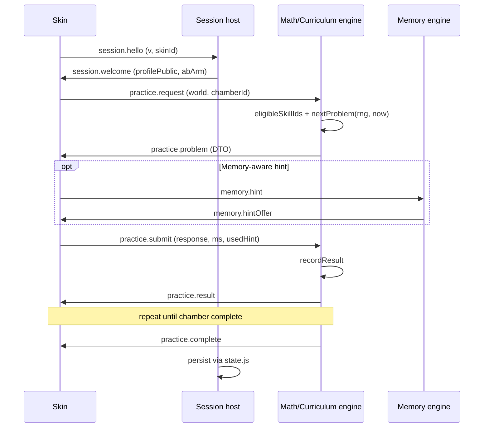
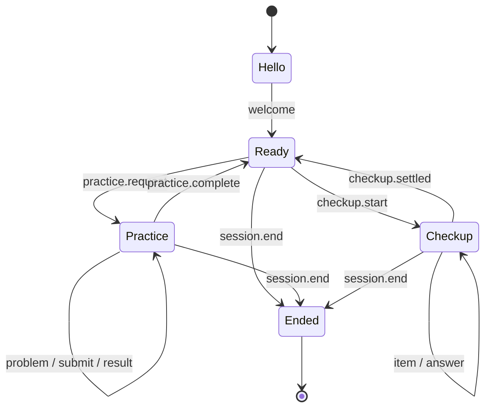

# Session protocol — thin engine↔skin contract

A **versioned, JSON-shaped message protocol** between the in-repo learning
engine and any skin (voxel today, others later). Skins render and collect
intent; the engine owns problems, scoring, placement, and eligibility.

This extends — it does not replace — the function contracts already documented
in `ARCHITECTURE.md` (Math engine contract, Curriculum contract). Those remain
the in-process API; this protocol is the **boundary** multi-skin and future
workers/iframe skins will share.

## Non-goals

- Full RPC framework or network transport in Phase A–B (in-process bus is enough).
- Exposing Three.js / DOM types across the boundary.
- Letting skins call `recordResult` with crafted problems (engine issues
  `problem_id`s; skins answer them).
- Encoding island story / yijing beats (those stay game-local until a later
  revision explicitly adds them).

## Roles

| Role | Responsibility | Today’s code |
|------|----------------|--------------|
| **Engine** | `nextProblem`, `recordResult`, checkup machine, eligibility, memory hint picks | `src/mathengine.js`, `src/curriculum/*`, `src/memory/engine.js` |
| **Session host** | Profile load, rng seeding, clock injection, persist | `src/state.js`, `src/main.js`, `src/rng.js` |
| **Skin** | Present problem model, capture child intent, juice | `src/chamberflow.js`, `src/verbs/*`, HUD/screens; future skins |
| **Scene shell** | Mode switch / mount (orthogonal to math protocol) | `src/scenes/registry.js`, `src/scenes/mount.js` |

## Versioning

- Protocol id: `monkeygrove.session`
- Field: `v` integer (start at `1`)
- Backward rule: skins declare `minV`/`maxV`; host refuses mismatch with a
  soft parent-facing message (never a child “error”).
- Schemas (Phase B+): JSON Schema documents validated with `@jarenjs/validate`
  — see [JARENJS_INTEGRATION.md](./JARENJS_INTEGRATION.md).

## Message groups (v1 sketch)

### Lifecycle

| Message | Dir | Purpose |
|---------|-----|---------|
| `session.hello` | skin→host | `{ v, skinId, capabilities[] }` |
| `session.welcome` | host→skin | `{ v, profilePublic, settingsComfort, abArm? }` |
| `session.end` | either | reason code; flush telemetry |

`profilePublic` is child-safe: name, avatar cosmetics, language — **not** raw
Elo tables. Parent dashboard stays outside the skin protocol (`appflow.js`).

### Practice (chamber)

| Message | Dir | Purpose |
|---------|-----|---------|
| `practice.request` | skin→engine | `{ world?, kind?, echo?, chamberId }` |
| `practice.problem` | engine→skin | Problem DTO (below) |
| `practice.submit` | skin→engine | `{ problemId, response, ms, usedHint, verbMeta? }` |
| `practice.result` | engine→skin | `{ correct, delta, scaffold, explain, misconception?, rewardsPreview }` |
| `practice.complete` | engine→skin | chamber clear / bloom / echo offer |

### Placement (Mimi’s Check)

Maps the pure machine in `src/curriculum/checkup.js` + UI in
`src/checkupflow.js`:

| Message | Dir | Purpose |
|---------|-----|---------|
| `checkup.start` | skin→engine | `{ mode: 'probe' }` |
| `checkup.item` | engine→skin | item request from `checkupNext` |
| `checkup.answer` | skin→engine | `{ correct, ms, tag? }` → `checkupRecord` |
| `checkup.settled` | engine→skin | `checkupResult` + calibration summary |

### Memory help

| Message | Dir | Purpose |
|---------|-----|---------|
| `memory.hint` | skin→engine | `{ problemId }` |
| `memory.hintOffer` | engine→skin | anchor / loci / arm from `anchorForProblem`, `pickHintArm` |
| `memory.recall` | skin→engine | `{ factKey, ok }` → `recordAnchorRecall` |

## Problem DTO (align with ARCHITECTURE.md)

Skin-facing shape mirrors `nextProblem` output, minus anything that invites
cheating or leaks parent-only labels:

```json
{
  "id": "…",
  "skillId": "tables_b",
  "world": "garden",
  "kind": "array",
  "equation": "7 × ⬚ = 42",
  "prompt": { "key": "…", "vars": {} },
  "choices": [{ "value": 6, "tag": "correct" }],
  "model": { "kind": "array", "rows": 7, "cols": 6 },
  "scaffold": 1,
  "accept": null,
  "explain": { "key": "…", "vars": {} }
}
```

Notes:

- `answer` may be omitted for constructed kinds when the skin uses `model` +
  engine-side grading via `practice.submit` (preferred for array/share/line).
- Fetch may include choice values; tags like misconception ids are OK for
  explanation routing after submit, not for pre-answer UI chrome.
- `difficulty` / raw ratings stay engine-internal unless a parent skin asks.

## Sequence — one chamber problem



## State machine (session)



## Determinism rules (carry from ARCHITECTURE.md)

- Engine never reads ambient entropy or wall clock: host injects `rng` and
  `now` (already true for `nextProblem` / `recordResult`).
- Same `(mathState, curriculumState, rng seed, now, request)` → same problem.
- Skins must not seed their own math rng for scoring paths.

## Integration with scenes

`src/scenes/registry.js` remains the **activity** registry (business, stage,
future memory walk scene, …). The session protocol is **orthogonal**: a scene
controller may *be* a skin adapter, or the voxel chamber flow may wrap the
protocol internally first (strangler pattern — see
[ENGINE_EXTRACTION.md](./ENGINE_EXTRACTION.md)).

## Cross-links

- Extraction plan: [ENGINE_EXTRACTION.md](./ENGINE_EXTRACTION.md)
- Skins: [MULTI_SKIN.md](./MULTI_SKIN.md)
- Events emitted alongside messages: [MEMORY_AND_TELEMETRY.md](./MEMORY_AND_TELEMETRY.md)
- Schema validation via jarenjs: [JARENJS_INTEGRATION.md](./JARENJS_INTEGRATION.md)
