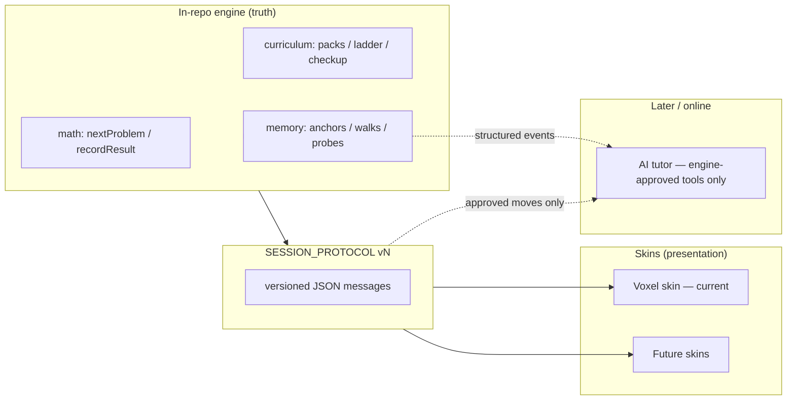

# Vision — curriculum engine + skins + memory, AI later

## One sentence

Monkeygrove stays a **cozy offline-first island game** whose heart is a
**deterministic curriculum/math engine**; looks and chrome become **swappable
skins**; help that remembers the child stays **on-device**; optional AI tutoring
arrives **last**, online-only, and may only speak moves the engine already
approved.

## Why this shape

Today the adaptive spine already exists as pure logic:

- Problems: `nextProblem` / `recordResult` / `masteryReport` via
  `src/mathengine.js` (implementation under `src/math/`).
- School mapping & placement: `src/curriculum/` (`NL_PO`, 64-step ladder,
  Mimi’s Check in `checkup.js` + `checkupflow.js`).
- Method-of-loci aids: `src/memory/engine.js` (docs/06).
- Presentation: Three.js voxel dioramas, verbs in `src/verbs/`, chambers in
  `src/chamberflow.js`, hub/scenes via `src/scenes/registry.js`.

The next risk is **coupling**: if every new look, A/B chrome, or tutor feature
reaches into chamber DOM/Three directly, pedagogy and presentation fuse again.
The fix is a **thin session protocol** ([SESSION_PROTOCOL.md](./SESSION_PROTOCOL.md))
so skins compete on experience while the engine owns truth.

jarenjs is the author’s JSON/schema/contract/FSM/AI toolkit
(`/workspace/jarenjs`). Monkeygrove should **use it where schemas, contracts,
and (later) tool-guarded agents help** — not relocate the Dutch primary path
into that monorepo. See [JARENJS_INTEGRATION.md](./JARENJS_INTEGRATION.md).

## Product pillars

1. **Curriculum-as-engine** — Harden seams already sketched in
   `ARCHITECTURE.md` (“Math engine contract”, “Curriculum contract”) into an
   explicit, versioned, schema-validated session API. Details:
   [ENGINE_EXTRACTION.md](./ENGINE_EXTRACTION.md).
2. **Multi-skin frontends** — Voxel remains default; alternate skins speak the
   same protocol so A/B tests compare chrome, not curricula.
   [MULTI_SKIN.md](./MULTI_SKIN.md), [AB_TESTING.md](./AB_TESTING.md).
3. **Memory-aware help first** — Prefer loci anchors, misconception tags, and
   scaffold levels over generative chat. Telemetry stays local until a parent /
   school explicitly opts into export.
   [MEMORY_AND_TELEMETRY.md](./MEMORY_AND_TELEMETRY.md).
4. **AI tutoring later** — When online: `@jarenjs/ai` tool registry validates
   every tool call against engine schemas; the model cannot invent skill paths
   or problems. [ROADMAP.md](./ROADMAP.md) Phase D.

## Experience constraints (carry forward from DESIGN.md)

- No countdown timers in core play; no lives / Game Over / ads / accounts.
- Child vocabulary: worlds, quests, eggs, gems, pets — not “test” / “lesson”.
- Parent screens may show curriculum, stage, coverage
  (`coverageForReport` in `src/curriculum/index.js`).
- Offline PWA + `localStorage` (`src/state.js`) remains the default storage.

## Success looks like

- A second skin can run a chamber end-to-end using only the session protocol
  (no imports from `chamberflow.js` / `verbs/*`).
- A/B assignment changes look, not Elo / ladder / checkup math.
- An offline week of play still produces a complete structured event log an
  online tutor can later consume without re-deriving pedagogy.
- Adding `@jarenjs/validate` (and later contract/flow/ai) does **not** require
  moving `src/curriculum/nl_po.js` or `ladder.js` out of Monkeygrove.

## Non-goals

- Replacing the voxel game with a “headless app + random UI”.
- Server-authoritative learning (unless a future school product opts in).
- Curriculum content living primarily in jarenjs packages.
- AI that generates free-form arithmetic exercises outside generators under
  `src/math/generators/`.

## Cross-links

- Protocol: [SESSION_PROTOCOL.md](./SESSION_PROTOCOL.md)
- Adoption plan: [JARENJS_INTEGRATION.md](./JARENJS_INTEGRATION.md)
- Phases: [ROADMAP.md](./ROADMAP.md)
- Upstream ideas only: [UPSTREAM_TO_JARENJS.md](./UPSTREAM_TO_JARENJS.md)
