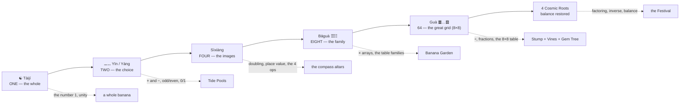
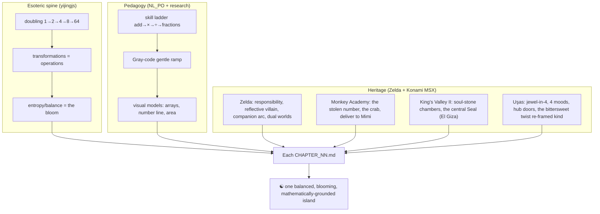

# Monkey Grove — Story Mode 🍌☯️ *The Book of Banana Changes*

> A seven-phase story arc that turns the **anti-anxiety math adventure** of *Monkey Grove*
> into a quiet retelling of the oldest mathematics book on Earth — the **Yijing (I Ching)**.
>
> The child never hears the words "I Ching," "binary," or "exponent." They hear: *the island
> was one whole thing; the Crab King split it; you weave it back together, one gentle line at
> a time, until it is balanced again.* Underneath that cozy sentence is the exact cosmology the
> [`yijingjs`](https://github.com/jklarenbeek/yijingjs) engine computes — and the exact
> mathematics the `NL_PO` curriculum teaches.

This folder is the **story bible**. It is canon. Every `CHAPTER_NN.md` obeys the maps below so
the seven files interlock into one hexagram. Read this first; then read the chapters in order.

- **[CHAPTER_00 — The One](CHAPTER_00.md)** · *Wújí · Tàijí* · the whole, the fall, the theft
- **[CHAPTER_01 — The Two Modes](CHAPTER_01.md)** · *Yīn–Yáng* · Tide Pools · `+ −`
- **[CHAPTER_02 — The Four Images](CHAPTER_02.md)** · *Sìxiàng* · the four directions awaken
- **[CHAPTER_03 — The Eight Friends](CHAPTER_03.md)** · *Bāguà* · Banana Garden · `×`
- **[CHAPTER_04 — The Five Phases](CHAPTER_04.md)** · *Wǔxíng* · Sharing Stump · `÷`
- **[CHAPTER_05 — The Sixty-Four Changes](CHAPTER_05.md)** · *Guà* · Vine Heights · fractions
- **[CHAPTER_06 — The Four Roots](CHAPTER_06.md)** · *cosmic convergence* · the Festival, balance restored

---

## 1. Why the Yijing is secretly a math curriculum

The Yijing is built by **repeated doubling**. The *Xìcí* (Great Commentary) states the whole
program in one line:

> 易有太極，是生兩儀，兩儀生四象，四象生八卦
> *"The Changes have a Great Ultimate. It gives birth to the Two Modes. The Two Modes give
> birth to the Four Images. The Four Images give birth to the Eight Trigrams."*

That is **2⁰ → 2¹ → 2² → 2³ → 2⁶**:

```
   1   →   2   →   4   →   8   →  …  →   64
 Tàijí   Yīn    Sìxiàng  Bāguà        Guà (hexagrams)
 (whole) Yáng   (4 imgs)(8 trigrams)  (8 × 8 grid)
   2⁰     2¹      2²       2³           2⁶
```

Every node is a power of two. The leap from 8 to 64 is **8 × 8** — a multiplication table.
A hexagram is **6 binary lines** (yáng `⚊` = 1, yīn `⚋` = 0), so the 64 hexagrams are exactly the
6-bit numbers 0–63. Leibniz noticed this in 1703. We are simply letting a nine-year-old notice it
too, without ever saying the word "binary."



This is why the story can be *both* an esoteric adventure *and* a research-grade arithmetic
spine: **they are the same shape.** Counting up the powers of two **is** the plot.

---

## 2. The master map (canon)

Each numbered chapter is one **phase of the doubling**, one **world of the hub**, one band of the
**`NL_PO` ladder**, one **trigram-line of the founding hexagram**, and one **emotional beat** of the
Zelda-style arc. Keep these columns aligned in every chapter file.

| Ch | Esoteric phase | Number | Hub world | `NL_PO` skills (from `mathengine.js`) | Sacred tool | Mimi / Crab King beat |
|----|----------------|:------:|-----------|----------------------------------------|-------------|------------------------|
| 00 | **Tàijí** — the One | `1` | the whole island (pre-fall) | *placement warm-up* | Tool: the **Altar of Balance** | Mimi cheerful → the theft → both stunned |
| 01 | **Yīn–Yáng** — Two Modes | `2` | 🌊 Tide Pools | `add_20 · sub_20 · missing_addend · add_100 · sub_100` | **Tide Stone** (the line-drawer) | Mimi anxious, blames herself |
| 02 | **Sìxiàng** — Four Images | `4` | the 4 compass altars / world reveal | doubling & halving · place value · the 4 ops named | **Lens of Echoes** (the Gray Echo Realm) | Mimi: "there used to be four of everything…" |
| 03 | **Bāguà** — Eight Friends | `8` | 🌱 Banana Garden | `tables_a · tables_b · tables_c · tables_mix · mult_2digit` | **Hookshot of Arrays** | Mimi opens up (Phase 2); the Eight return |
| 04 | **Wǔxíng** — Five Phases | `5` | 🥥 Sharing Stump | `div_facts · share · div_remainder · missing_factor` | **Wheel of Phases** | Crab King first appears *inside* chambers |
| 05 | **Guà** — Sixty-Four | `64` | 🍇 Vine Heights + 💎 Gem Tree | `frac_magnitude · frac_compare · frac_equiv · frac_of_n` | **Compass of Ratios** | Bridge built; Mimi nearly whole |
| 06 | **4 Roots** — convergence | `4→balance` | 🌉 the islet + 🎪 Festival Plaza | mixed review (Echo Doors) · inverse reasoning · `missing_factor` | the Altar **rebalanced** | Crab King's reveal → friend |

> [!NOTE]
> **Chapter 04 is "5," which breaks the doubling — on purpose.** The Five Phases (*Wǔxíng*) are the
> Yijing's other engine: a **cycle**, not a doubling. They are the perfect home for **division**,
> which is the operation that *cycles back* and *undoes* (the inverse of multiplication). The break
> in the pattern is the lesson: *not everything grows by doubling; some things turn in a wheel.*

---

## 3. The Eight Friends are the Eight Trigrams

*Monkey Grove* already ships eight companions (`src/mesh/`). They map onto the **Bāguà family**
one-to-one — the classical "father, mother, three sons, three daughters." We drop the gendered
framing for kids and call them **the Eight Friends**, but each keeps its trigram's *element*,
*image*, and *temperament*, which decides what facet of math it teaches and which build it brings to
the hub (per `DESIGN.md` and `island.js`).

| Trigram | Glyph | Binary | Element | Image / temperament | Friend (`mesh/`) | Teaches / build perk |
|---------|:-----:|:------:|---------|---------------------|------------------|----------------------|
| **Qián** Heaven | ☰ | `111` | Metal | Creative, strong — *the Dragon* | **Dragon** (legendary pet) | the whole, the "all"; the Gem Tree's crown |
| **Kūn** Earth | ☷ | `000` | Earth | Receptive, devoted | **Tuk** the Turtle | zero, grouping, the patient base |
| **Zhèn** Thunder | ☳ | `100` | Wood | Arousing, the spark | **Kiki** the Kitten | rhythm & skip-counting; **music stage** (the gong) |
| **Kǎn** Water | ☵ | `010` | Water | Flowing, the deep | **Dot** the Duckling | number line & flow; the tides |
| **Gèn** Mountain | ☶ | `001` | Earth | Still, steadfast | **Rin** the Red Panda | place value, "hold still and count"; **fruit stand** |
| **Xùn** Wind | ☴ | `011` | Wood | Gentle, penetrating | **Olli** the Owl | strategy & estimation; the gentle hint |
| **Lí** Fire | ☲ | `101` | Fire | Clinging, radiant, clarity | **Mo** the Piglet | sharing heat evenly; **bakery oven** (fractions of a pie) |
| **Duì** Lake | ☱ | `110` | Metal | Joyous, reflective | **Pip** the Bunny | joy of getting it; remainder-berries |

**Mimi is not one of the Eight.** Mimi is the memory of the **Tàijí** — the one friend who recalls
the island *before* it was split. Her arc (anxious → opening up → whole) is the island's entropy
climbing back toward balance. The **player's monkey** is the *moving line* — the changing yáo that
travels through all six stages and re-weaves the whole.

The **Crab King** is the **inversion** (`yijing_invert`): when he stole the numbers he drained every
yáng line, collapsing the island to **all-yīn** — pure gray, entropy `0`. He is not evil; he is
*unbalanced*, and lonely in the way `000000` is lonely. The finale does not defeat him; it
**rebalances** him.

---

## 4. The transformations are the operations

`yijingjs` exposes a small set of unary transformations on hexagrams. Each one *is* a piece of
arithmetic the child is already learning. This table is the heart of the "learn math through the
esoteric pattern" promise — every mechanic in the game is one of these.

| `yijingjs` function | What it does to a hexagram | The math it teaches | Where it lives in-game |
|---------------------|----------------------------|---------------------|------------------------|
| `yijing_neighbors()` | the 6 hexagrams **one line away** (Gray-code step) | *one small change at a time* → the gentle difficulty ramp | every problem differs from the last by one knob → **anti-anxiety pacing** |
| `yijing_invert()` | flip **all** lines (XOR 63), yīn↔yáng | **complement / inverse** → `7 + ? = 10`, the missing part, `1 − 3/4` | the **Gray Echo Realm** (flip world ↔ shadow) |
| `yijing_opposite()` | swap upper & lower trigram | **commutativity** → `7×8 = 8×7` | the Gem Tree lights a fact **and its twin** |
| `yijing_reverse()` | mirror the line order | reversal & symmetry → reading a fact both ways | array beds read as `r×c` and `c×r` |
| `yijing_center()` | the **nuclear hexagram** (inner essence) | **factoring / the hidden structure inside** | finding the factor; `? × 6 = 42` |
| Wǔxíng generating cycle | element **creates** the next | building **up**: `+` grows into `×` | Banana Garden arrays |
| Wǔxíng overcoming cycle | element **controls** the next | breaking **down**: `÷` undoes `×`, `−` undoes `+` | Sharing Stump |
| `yijing_balance()` | yáng-lines ÷ 6 → `0.0`–`1.0` (`0.5` = perfect) | ratio, fraction-of-a-whole, the meaning of "balanced" | the **Altar of Balance**, the bloom meter |
| `yijing_entropy()` | `0` (pure) → `1.0` (3-yáng-3-yīn) | spread, fairness, "is this even?" | gray ↔ color of the whole island |

> [!TIP]
> **Gray code is the pedagogy.** The research notes in `docs/02-adaptive.md` ask for a difficulty
> ramp where the next problem is *one knob harder* than the last — never a cliff. That is exactly a
> **Gray-code walk** of the hexagram cube: `yijing_neighbors()` returns the moves that change a
> single line. The story-mode problem selector can literally call it. *The kindest way to teach is
> also the deepest law of the Book of Changes: change one line at a time.*

---

## 5. The founding hexagram is built line by line

This is the spine that makes the seven files **one object**, not seven essays.

The island begins as **Kūn doubled — `䷁` `000000`** — all yīn, all gray, entropy `0`. That is the
fall. Then **each numbered chapter restores exactly one line**, bottom to top, and the line it draws
**alternates** yáng, yīn, yáng, yīn, yáng, yīn. By the end of Chapter 06 the six lines spell:

```
        line 6  ⚋   Ch06 — yield / share (the top line is YIELDING, not grabbing)   ┐
        line 5  ⚊   Ch05 — mastery (the ruler line: the 64, fractions)              │ upper trigram
        line 4  ⚋   Ch04 — the cycle, division, the deep                            ┘  ☵ Kǎn (Water)
        line 3  ⚊   Ch03 — the Eight, multiplication blooms                         ┐
        line 2  ⚋   Ch02 — the four receptive directions                            │ lower trigram
        line 1  ⚊   Ch01 — the first distinction (a number returns)                 ┘  ☲ Lí (Fire)
```

⚊⚋⚊ over ⚋⚊⚋ … read bottom-to-top: ⚊⚋⚊⚋⚊⚋ = **Water ☵ over Fire ☲** =

> ### ䷾ Jìjì — **After Completion** (King Wen #63, a Cosmic Root)

This is not a random target. **After Completion** is:

1. **A cosmic root** — one of the four hexagrams that are their own nuclear centre
   (`yijing_isCosmic()` returns true for `0, 21, 42, 63`). The story converges to a root.
2. **Perfectly balanced** — `entropy = 1.0`, `balance = 0.5`. Three yáng, three yīn, in strict
   alternation: every line in its right place. *That is the restored island.*
3. **Water-over-Fire = a pot coming to the boil = the Math Feast.** Fire (the lit-up worlds, the
   lower trigram, Chapters 1–3) rises; Water (the deep, the islet, the Crab King's lonely sea, the
   upper trigram, Chapters 4–6) descends; they meet in the middle and **cook** — the Festival
   Plaza feast that ends the game.
4. **A warning, built in.** The *yáo* (line) texts of After Completion famously caution that *after*
   you succeed, things drift back toward disorder unless you keep tending them. The top line is
   **yīn — yielding** — because you finish the work by **sharing it** (letting the Crab King in),
   not by hoarding a sixth yáng. The arithmetic mirror: a "mastered" skill **decays** unless
   revisited (`mathengine.js` forgetting curve; Echo Doors). *Completion is a practice, not a
   trophy.*

> [!IMPORTANT]
> **The anti-perfectionism moral is load-bearing.** The Crab King's mistake was wanting the island
> to be *all one thing* (all his, all hoarded — pure yīn). The naïve "hero" mistake would be the
> opposite: all yáng, every number grabbed back, the arrogant dragon of Qián's top line. The Yijing
> says **both extremes decay**; only the woven, alternating, *balanced* state holds. This is the
> same message as the game's anti-anxiety guarantees: *you are not trying to be perfect (all-yáng);
> you are trying to be balanced.*

---

## 6. What the story must never break

The story layer is **additive**. It may not violate the non-negotiables in `DESIGN.md`:

- **No Game Over, no hearts, no punitive timers.** The Crab King is a thief, never a threat; crabs
  freeze while a stone is carried. Restoring a line can never *un*-restore (portal stages only rise;
  `flags.portalStages`).
- **No school words in child UI.** "Yijing," "trigram," "binary," "exponent," "hexagram" are
  *author/parent* vocabulary — they live in these docs and the parent dashboard, never in the
  child's bubble. The child hears: **the One, the Two Modes, the Four Directions, the Eight Friends,
  the Wheel, the Great Grid, the Balance.**
- **Understanding over speed.** Lines are drawn by *mastery* (the same progress points that gate
  builds in `island.js`), never by clearing fast. You cannot farm the hexagram with easy chambers.
- **Bilingual EN/NL.** Esoteric names get warm, child-safe EN/NL labels (see each chapter's
  *Localization* note). The `bagua.json` / `sixiang.json` Dutch strings (`Aarde, Water, Vuur,
  Lucht…`) are reused so the cosmology speaks Dutch natively.

---

## 7. How the three lineages braid together

Three sources feed every chapter. Keep all three visible.



- **Zelda** (the user's enrichment doc) gives the *emotional* architecture: the Accidental Catalyst,
  the Reflective Antagonist, Mimi's arc, the Gray Echo Realm, the Sacred Tools. Each chapter names
  which pillar it advances.
- **Monkey Academy (1984)** is the *core loop's ancestor*: a number goes missing, a crab took it,
  you find it and carry it to the helper monkey. Honored literally in the **Fetch** verb.
- **King's Valley II (1988)** is the *chamber/Seal* ancestor: soul-stones gathered room by room,
  converging on the central pyramid **El Giza** whose **Seal** must be set right. Our El Giza is the
  **Altar of Balance**; our soul-stones are number stones; the four **Cosmic Roots** are its four
  sealed cores.
- **Uşas (1987)** is the *structure & tone* ancestor: a power split into **four** pieces, **four
  moods**, a hub of doors, and a famous *bittersweet twist* (the treasure is a doomsday weapon). We
  keep the four-fold structure and the twist — but **invert its cruelty**: the "weapon" the Crab King
  guarded was only his loneliness, and the treasure is the feast you share.

---

## 8. Optional: wiring story-mode to `yijingjs`

These docs are design canon, but the mapping is concrete enough to *run*. If story mode is built, a
thin `src/story/` module can import the `@yijing/core` package and let the Book drive the systems it
already mirrors:

- **Problem pacing** → `yijing_neighbors(state)` to pick the next "one-line-harder" problem.
- **The bloom meter** → `yijing_balance(islandHexagram)` and `yijing_entropy(...)` for the gray↔color
  curve, so the whole island's color is a real function of how balanced your skills are.
- **The line-draw ceremony** → as each world reaches its mastery threshold, set its line; render the
  growing hexagram with the trigram/relation glyphs (`yijing_relationEmojiChar`: 💠 centre, 🔄
  opposite, 🪞 mirror…).
- **Echo Doors** → `yijing_invert()` for the shadow problem; spaced review is the "tending" After
  Completion warns you not to skip.
- **The finale** → `yijing_getCenterChain(h)` to animate every hexagram collapsing through its
  nuclear centres down to one of the **four Cosmic Roots** — the four cores of the Altar lighting at
  once.

Internal IDs stay English (`story.phase.sixiang`, `friend.dragon.qian`); EN/NL labels live in
`i18n.js`, reusing the Dutch element words already in `bagua.json` / `sixiang.json`.

---

*Next: **[CHAPTER_00 — The One](CHAPTER_00.md)**.*
